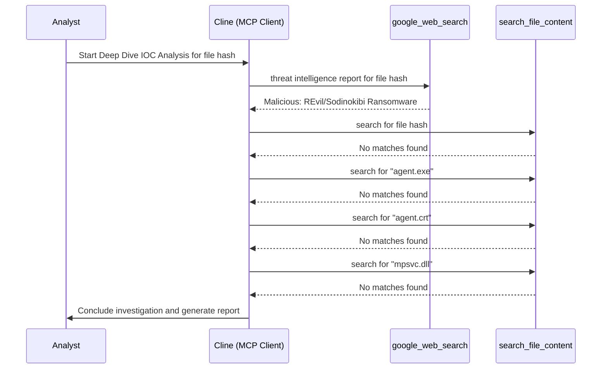

# Deep Dive IOC Analysis Report: d55f983c994caa160ec63a59f6b4250fe67fb3e8c43a388aec60a4a6978e9f1e

**Runbook Used:** Deep Dive IOC Analysis Runbook
**Generated:** 2025-08-31 13:00 UTC
**IOC:** d55f983c994caa160ec63a59f6b4250fe67fb3e8c43a388aec60a4a6978e9f1e (File Hash)

## 1. Summary

A deep dive investigation was performed on the file hash `d55f983c994caa160ec63a59f6b4250fe67fb3e8c43a388aec60a4a6978e9f1e`, which was found on the Google Drive of user "Ben Boogaerts". The investigation included a review of open-source threat intelligence and a search of internal security logs.

## 2. Findings

*   **Threat Intelligence:** The file hash is confirmed to be malicious and is associated with the **REvil/Sodinokibi ransomware**. The file is a dropper named `agent.exe` and was a key component in the Kaseya VSA supply-chain attack.
*   **Internal Log Analysis:** A comprehensive search for the file hash and its associated file names (`agent.exe`, `agent.crt`, `mpsvc.dll`) within the internal logs yielded no results.

## 3. Assessment

While the file is highly malicious, there is no evidence to suggest that it was ever executed within our environment. The incident appears to be isolated to the user's Google Drive. The risk of a widespread compromise from this specific file is currently low.

## 4. Recommendation

1.  **Notify User:** Inform "Ben Boogaerts" about the malicious file on his Google Drive and advise him to delete it immediately.
2.  **Endpoint Scan:** As a precautionary measure, the user's machine should be scanned for any signs of compromise.
3.  **Monitoring:** No immediate further action is required from the SOC, but the situation should be monitored.

## 5. Workflow

