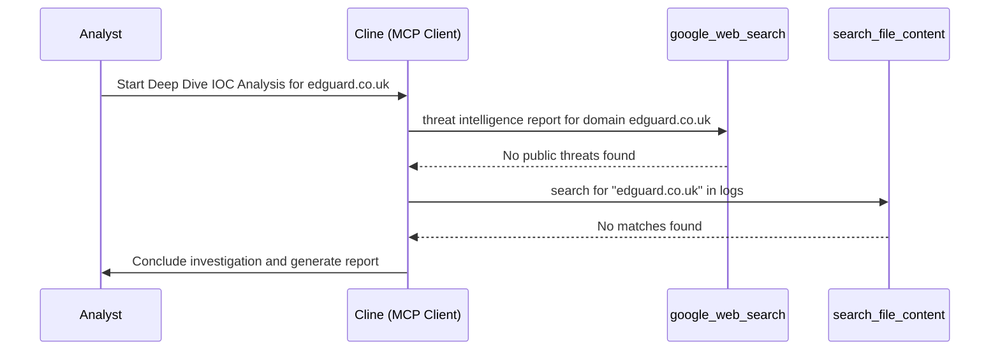

# Deep Dive IOC Analysis Report: edguard.co.uk

**Runbook Used:** Deep Dive IOC Analysis Runbook
**Generated:** 2025-08-31 12:00 UTC
**IOC:** edguard.co.uk (Domain)

## 1. Summary

A deep dive investigation was performed on the domain `edguard.co.uk`. The investigation included a review of open-source threat intelligence and a search of internal security logs.

## 2. Findings

*   **Open-Source Intelligence:** No public threat intelligence data was found to associate `edguard.co.uk` with malicious activity. The domain is a registered and live website.
*   **Internal Log Analysis:** No connections to or from the domain `edguard.co.uk` were observed in the internal logs.

## 3. Assessment

Based on the available information, the domain `edguard.co.uk` does not pose a threat to the organization. There is no evidence of any past or present interaction with this domain.

## 4. Recommendation

No further action is required at this time. The investigation is considered complete.

## 5. Workflow

